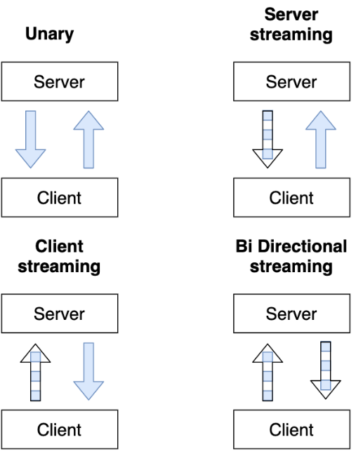

# Overview
### gRPC là gì ?

- general-purpose Remote Procedure Calls
- gRPC là một framework open-source, miễn phí được phát triển bởi Google 
- Là một phần của Cloud Native Computing Foundation - giống như Docker & Kubernetes
- Xây dựng trên HTTP/2.0 

- Định nghĩa message và service sử dụng Protocol Buffers
- gRPC sẽ generate code, chỉ cần implement phần xử lý
- File .proto có thể generate ra nhiều ngôn ngữ lập trình

### Protocol Buffers trong gRPC 
- PB được dùng để định nghĩa: Message (data, Request, Response) Service (tên service và rpc endpoint)
- Sau đó chúng ta generate code!

### Tại sao sử dụng Protocol Buffers
- Dễ viết định nghĩa của các message
- Định nghĩa API tách biệt với việc implement của nó
- Rất nhiều code được gen, với nhiều ngôn ngữ từ 1 file .proto
- Payload là binary, việc gửi/nhận qua network và serialize/deserialize trên CPU  rất hiệu quả
- PB có những quy định giúp việc phát triển  API không ảnh hưởng đến những client hiện có, hiệu quả trong microservice.

### API trong gRPC
- Có 4 loại:
  - Unary
  - Server streaming
  - Client streaming
  - Bi directional streaming

### gRPC vs REST
| gRPC   | REST   | 
|------------|------------|
| Protocol Buffers, nhỏ, nhẹ, nhanh| JSON, text base, to hơn ,chậm hơn |
| HTTP/2 - 2015 | HTTP/1.1 - 1997 |
| Bidirection & async | Client -> server request |
| Stream support | Request/Response | 
| API Oriented | CRUD Oriented (POST GET PUT DELETE) |

References:
- Well known types: https://protobuf.dev/reference/protobuf/google.protobuf/